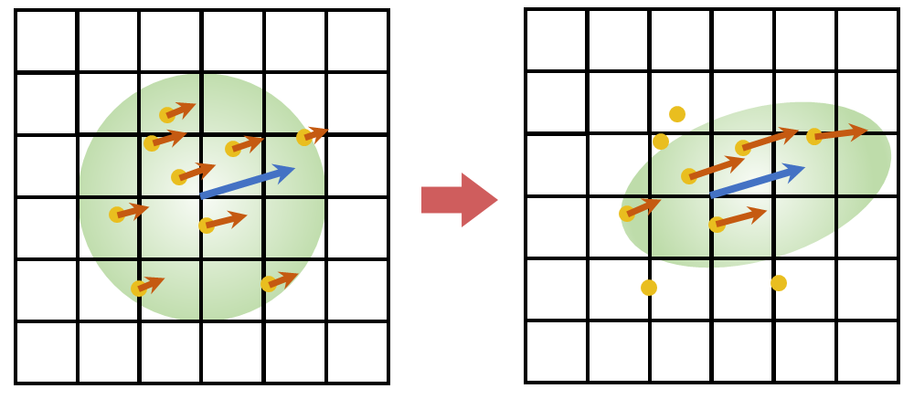
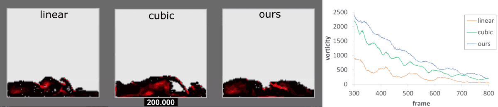
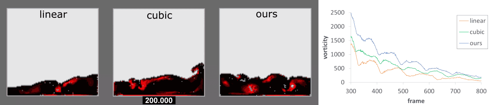

# AnisoFLIP
## Overview
AnisoFLIP is a liquid simulation which implements the anisotropic kernel function for FLIP advection. This simulation is based on <A href="https://github.com/jklee95/GridLiquid2D">GridLiquid2D</A> and is rendered using <A href="https://github.com/jklee95/DXViewer">DXViewer</A>.

## Method


Our method does not define a new kernel function, but rather transform the existing kernel in the direction of the velocity. The transformation of a kernel function can be implemented with the following matrix M:

$$
\textbf{M} = \textbf{TRS}
$$

$$
\textbf{T}=
    \begin{pmatrix}
    1 & 0 & 0 & \frac{F_x + F'_x}{4} \\
    0 & 1 & 0 & \frac{F_y + F'_y}{4} \\
    0 & 0 & 1 & \frac{F_z + F'_z}{4} \\
    0 & 0 & 0 & 1 
    \end{pmatrix}
    \quad
    \textbf{R}=
    \begin{pmatrix}
    \textbf{u}_x & \textbf{v}_x & \textbf{w}_x & 0 \\
    \textbf{u}_y & \textbf{v}_y & \textbf{w}_y & 0 \\
    \textbf{u}_z & \textbf{v}_z & \textbf{w}_z & 0 \\
    0 & 0 & 0 & 1 
    \end{pmatrix}
    \quad
    \textbf{S}=
    \begin{pmatrix}
    \frac{a}{r} & 0 & 0 & 0 \\
    0 & \frac{b}{r} & 0 & 0 \\
    0 & 0 & \frac{c}{r} & 0 \\
    0 & 0 & 0 & 1 
    \end{pmatrix}
$$

where F and F′ are the foci, v and w are the vectors orthogonal to the velocity u, r is the
radius of the kernel function, and a, b, c are axes of a spheroid. More details are described in the <A href="https://github.com/jklee95/AnisoFLIP/blob/master/docs/paper.pdf">full paper</A>.

## Result
### 2D Simulation
#### Single water Smashing

####  Double water Smashing

### Visualization of the vortices
#### Single water Smashing

#### Double water Smashing

### 3D Simulation

3D Simulation is based on <A href="https://github.com/rlguy/Blender-FLIP-Fluids">FLIP Fluids</A> and is rendered using <A href="https://github.com/blender/blender">Blender</A>.

## Build
This repo was developed in the following environment:
* Windows 10 64-bit
* Microsoft Visual Studio 2019 on x64 platform (C++14)
* CMake 3.19.0
* GridLiquid 2.0.1
* DXViewer 3.1.0

You should update submodules before creating a project with cmake.

```bash
git submodule update --progress --init -- "ext/DXViewer"
```
